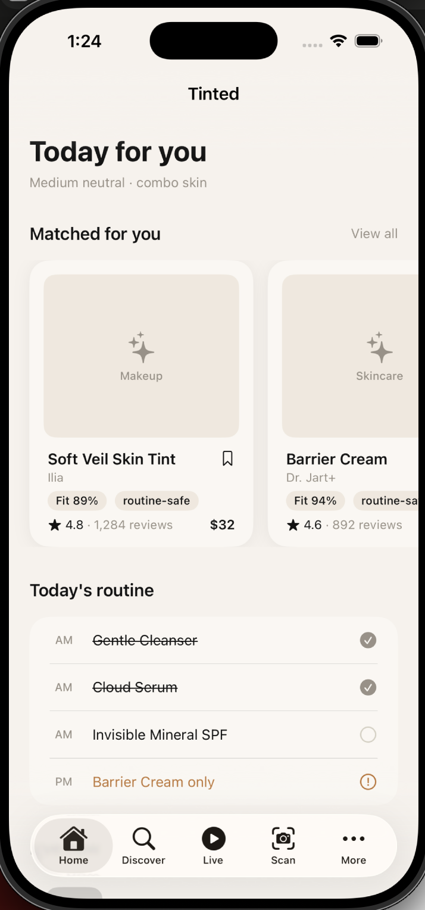
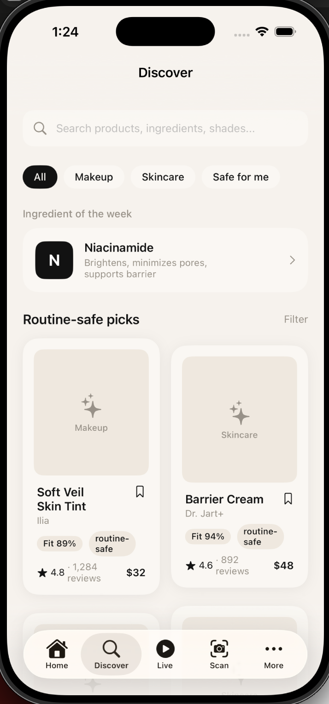
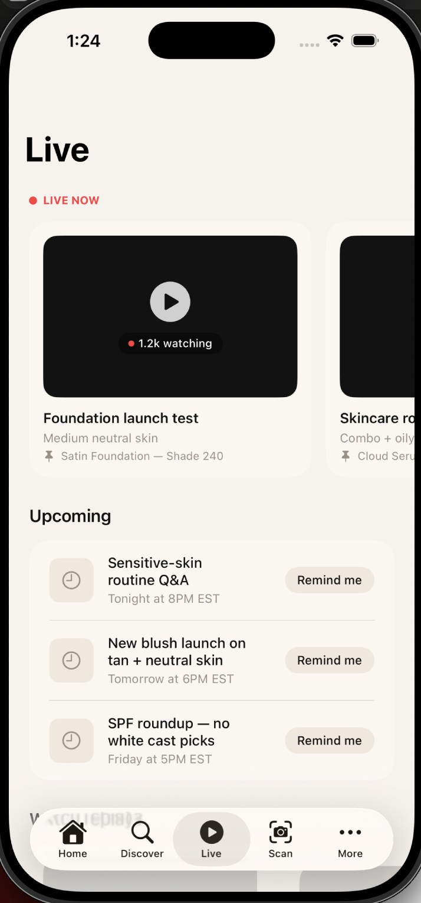
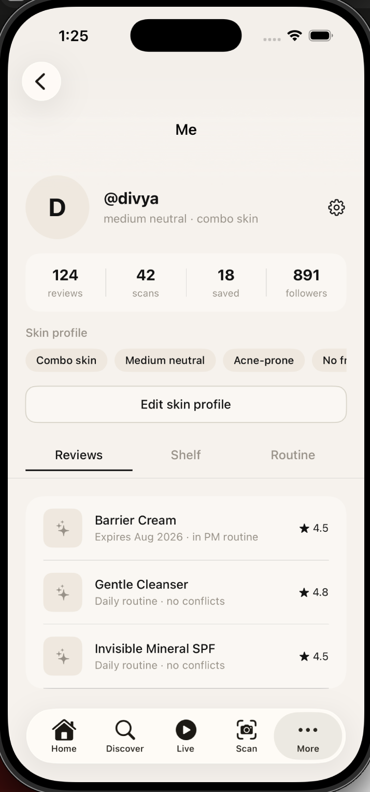
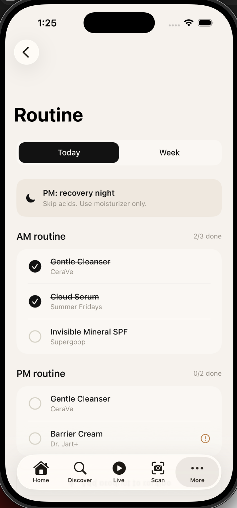
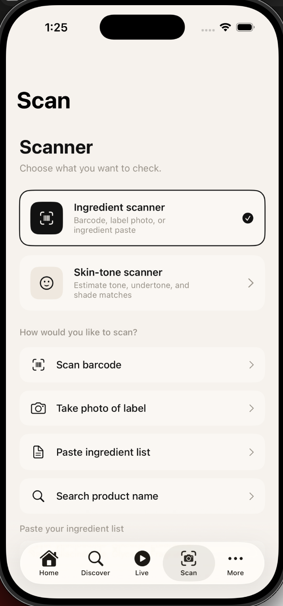

# Tinted

Tinted is a personalized beauty and skincare iOS app built around a clean, modern, off-white and black aesthetic. The app helps users discover products that fit their skin profile, scan ingredients, build routines, track product usage, and connect with beauty creators through live sessions.

The goal of Tinted is to make beauty feel more personal, simple, and useful by helping users understand what works for them instead of guessing through endless products.

## Preview

### Home

### Discover

### Live

### Profile

### Routine

### Scan

## What's Built

### Onboarding

- 5-step onboarding flow
- Welcome screen
- Skin type selection
- Skin concerns selection
- Ingredients/products to avoid
- Beauty goal selection
- Progress bar and animated transitions
- Saves onboarding status to device so it only appears once

### Home Feed

- Personalized header based on skin tone and skin type
- Horizontal scrolling product cards matched to the user profile
- Today's routine tracker with checkmark, skip, and warning states
- Live now banner that links to creator sessions

### Discover

- Search bar that filters products by name and brand
- Category filter pills for All, Makeup, Skincare, and Safe for me
- Ingredient of the week card
- 2-column product grid with fit scores

### Product Detail

- Full product detail page
- Personal fit score bar
- Star ratings, review count, price, and shade match
- Key notes and product tags
- Product description
- “People like you said...” reviews filtered by skin tone and skin type
- Add to shelf, add to routine calendar, and write a review buttons

### Write a Review

- Star rating selector
- Shade used field
- Written review text area
- Skin type, tone, and wear experience tag selectors
- Repurchase yes/no option
- Publish button that only activates when rating and review are filled

### Scanner

- Ingredient scanner with barcode, photo, paste, and search options
- Skin-tone scanner with camera or upload option
- Ingredient results sheet with personal fit score
- Fit score bar
- Explanation of why the product fits
- Routine warning
- Ingredient breakdown
- Recent scans list

### Routine Calendar

- Today view with AM/PM routine steps
- Tap-to-check routine functionality
- Week view with active, acid, rest, and SPF labels
- Conflict avoided, consistency, and SPF streak cards
- Recovery night warning banner
- Add product to routine button

### Shelf + Profile

- Profile header with avatar, username, and skin profile tags
- Stats for reviews, scans, saved products, and followers
- Three main tabs: Reviews, Shelf, and Routine
- Shelf sub-tabs: Owned, Wishlist, and Scanned
- Edit skin profile button

### Live

- Live now horizontal scroll with viewer count
- Upcoming sessions with Remind me button
- Watch replays section
- Full live session detail page
- Video area, comments, pinned product, and comment input

## Why I Built This

I built Tinted because beauty apps often feel too generic. A product can work perfectly for one person and completely fail for another because of skin type, skin tone, ingredients, routine conflicts, or personal goals.

Tinted is meant to make that process easier by giving users a more personalized way to discover, scan, review, and organize beauty products.

## Project Status

This project is still in progress. I am actively improving the UI, user flow, personalization logic, and product experience.
